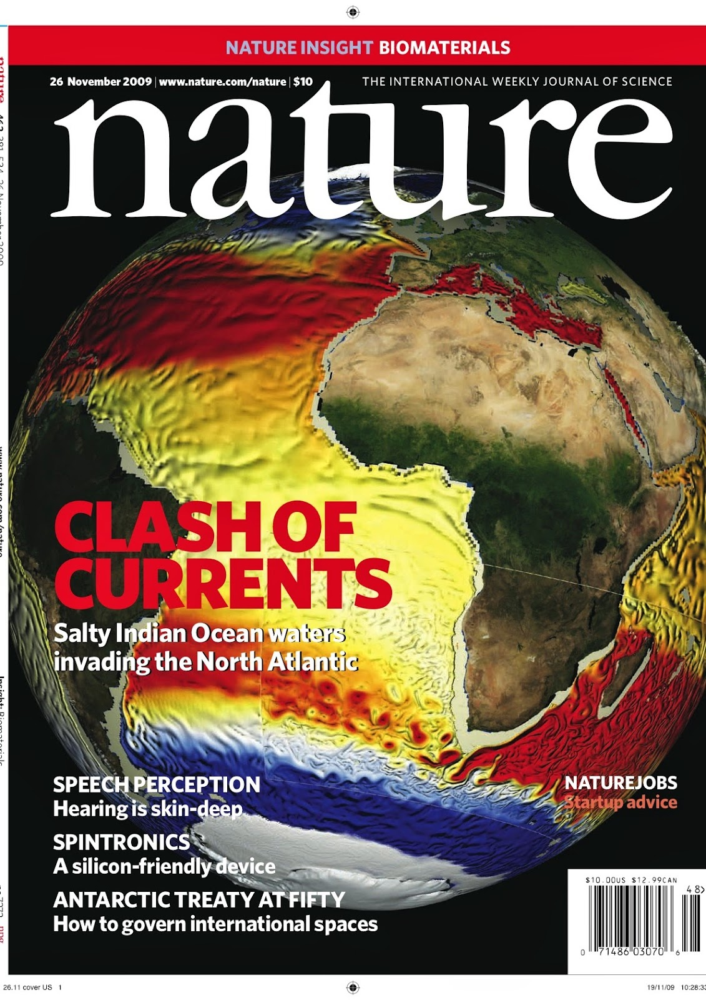

{: style="float: right" :height="36px" width="200px"}

### Numerical methods for oceanic and atmospheric flows

Developing numerical schemes is a special challenge that has to take into account the underlying physical properties of the governing equations. My main interests are in developing numerical schemes in the context of ocean and atmosphere modeling. I have been working on (i) the rotation of diffusion tensors along isopycnal directions in order to limit artificial diapycnal diffusion (ii) the numerical representation of internal-gravity waves propagation.

{: style="float: left" :height="36px" width="150px"}

### Structured mesh refinement methods

Increasing mesh resolution remains a key point in the improvement of the realism of numerical simulations. I am working on numerical schemes for integration of mesh refinement features in realistic numerical models. Grid interactions involve restriction and prolongation operators that have to be fullfiled several criteria : order of accuracy, conservation properties, management in time refinement in potentially complex time stepping algorithm (e.g. mode splitting) ... During the PhD of Ehouarn Simon we also worked on the application of variational data assimilation for nested models.

{: style="float: right" :height="36px" width="200px"}

### Multigrid methods and variational data assimilation
Multigrid methods can be used to accelerate the minimization of the cost function arising from optimal control techniques. I am particularly interested in their application to variational data assimilation problems in the frame of ocean atmosphere applications. Robutness of the use of multigrid methods is linked with the quality of the coarse grid approximation property that can be limited. For such an application, we derived very efficient hybrid multigrid preconditioners.

{: style="float: left" :height="36px" width="200px"}

### Coupling algorithms

I work on Schwarz waveform relaxation (SWR) methods. This is a space-time domain decomposition algorithm that can be applied to several coupling problems. Main research axes are related to (i) the derivation of optimized boundary conditions for the coupling of two parabolic equations (in link with the ocean atmosphere coupling problem) (ii) the use of SWR for computation on heterogenous platforms.